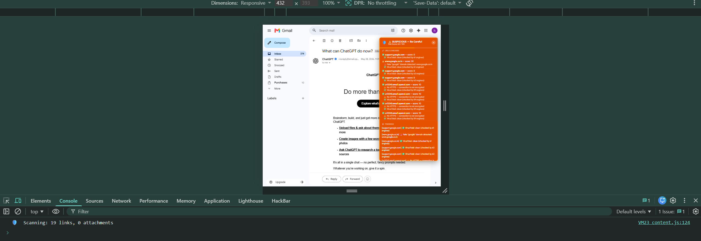
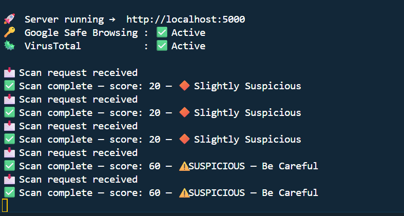
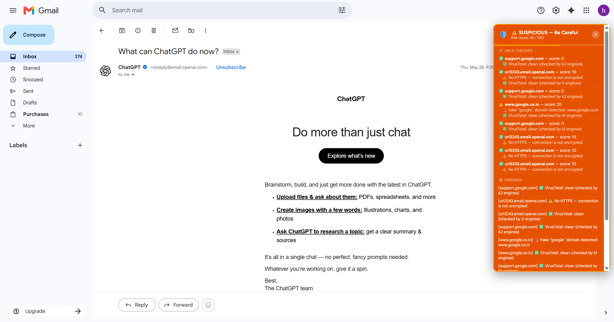

# phishing v2
Advance email phishing detector browser extension 

 for install:

   1. git clone https://github.com/harshvardhan4384/phishing-v2.git
   2. cd backend 
   3. npm install   
   4. npm run start

make sure you create .env file in backend folder 
in .env add api key like this:

     GOOGLE_API_KEY=Your_API_Key
     VIRUSTOTAL_API_KEY=Your_API_Key

 now open chrome

    1. go to chrome://extensions/
    2. Load unpacked
    3. now extension is ready just go to mail.com and it will automatically scan mail

   
while scanning make sure everthing is running like that press f12 and go to console

also check in vs code is there Google Safe browsimg & Virustotal is active 

here is how it will show output

